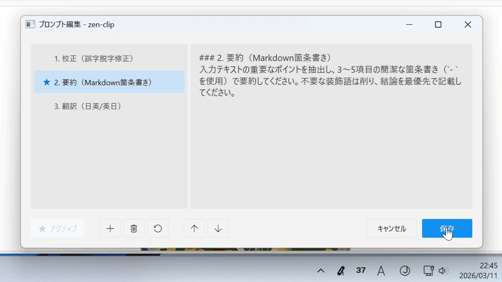
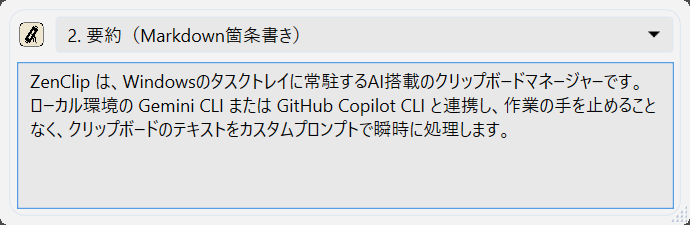
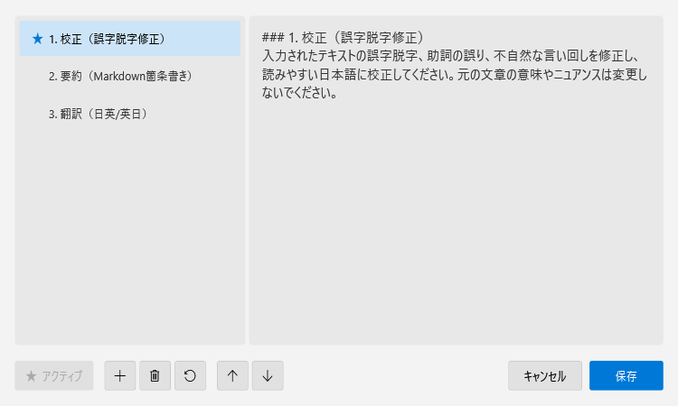
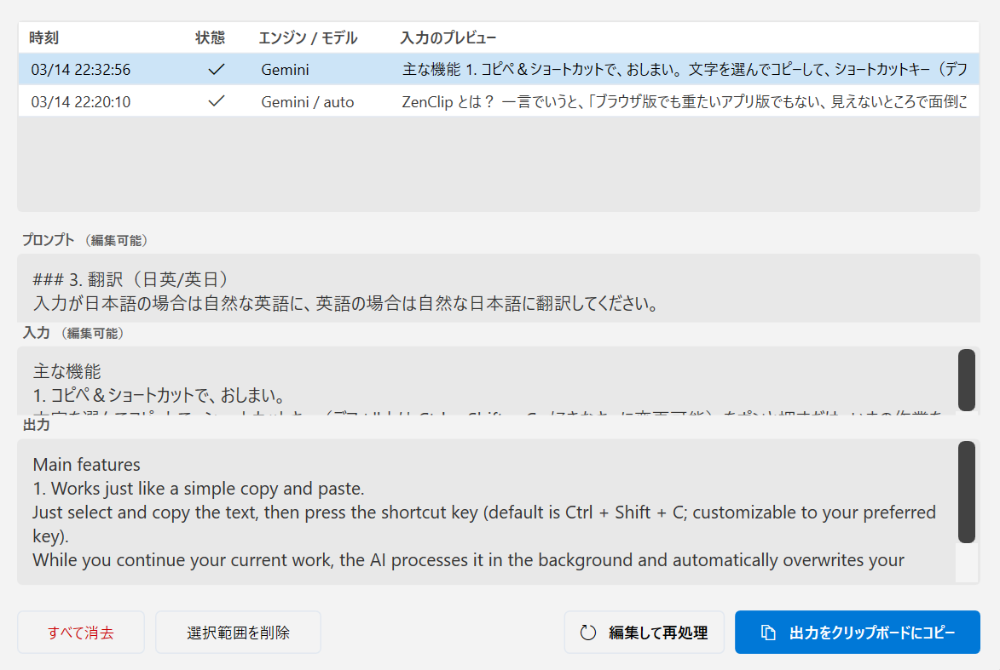
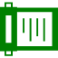
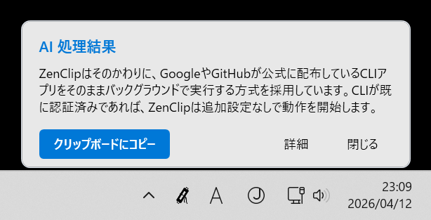

[English](README.md) | [日本語](README.ja.md)

# ZenClip

**ZenClip** は、Windowsのタスクトレイに常駐するAI搭載のテキスト処理アシスタントです。
ローカル環境の **Gemini CLI** または **GitHub Copilot CLI** と連携し、作業の手を止めることなく、**あらゆるテキスト**をカスタムプロンプトで瞬時にAI処理します。
コピーしたテキストをそのまま渡すことも、自分の言葉を直接入力することも、どちらも一つのショートカットキーで完結します。

**基本無料（機能制限あり）** でご利用いただけます。PolarでProライセンスを購入いただくことで、すべての機能が解放されます。

---

## ⚠️ 前提条件 (必須)

本アプリを利用するには、お使いのPCに以下のいずれか（または両方）のCLIツールがインストールされており、コマンドラインから実行できる状態になっている必要があります。

1. **[Gemini CLI](https://geminicli.com/)**: `gemini` コマンドが実行可能であること。
2. **[GitHub Copilot CLI](https://github.com/features/copilot/cli)**: `copilot` コマンドが実行可能であること。

*事前に、使用するCLIツールのセットアップを完了させてからご利用ください。*

---

## ✨ 主な機能

- **瞬時のAI処理**: テキストをコピーしてショートカットキー（デフォルト: `Ctrl + Shift + C`）を押すだけで、AIがバックグラウンドで処理を実行します。
- **プロンプトウィンドウ**: `Ctrl + Shift + P` でウィンドウを開き、プロンプトをリストから選ぶか、テキストをその場で直接入力して `Enter` キーで処理を実行します。まだコピーしていない、頭の中にある文章をそのままAIに渡したいときに便利です。
  
- **プロンプトチェーン**: 複数のプロンプトを順番に連結して実行できます。前のステップのAI出力が次のステップの入力として引き継がれ、複雑な変換処理を自動化できます。
- **マルチエンジン対応**: Gemini CLI だけでなく、GitHub Copilot CLI もエンジンとして選択可能です。
- **邪魔にならない設計**: タスクトレイに静かに常駐。処理中は極小のOSDが表示され、完了は通知でお知らせします。
- **カスタムプロンプト**: 用途に合わせたAIへの指示（プロンプト）を自由に追加・管理できます。インポート/エクスポートにも対応しています。
  
- **履歴管理**: AIの応答を自動保存。履歴ウィンドウから過去の結果を確認・再利用したり、キーワード検索やステータスフィルターで絞り込んだり、複数選択して一括削除することが可能です。
  
- **自動アップデート**: 新しいバージョンが公開されると自動で検出し、ワンクリックで更新できます。
- **多言語対応**: UIは英語と日本語に対応（OSの言語設定に合わせて自動で切り替わります）。

### ショートカットキー一覧

| ショートカット | 動作 |
| :--- | :--- |
| `Ctrl + Shift + C` | コピーしたテキストをそのままAI処理 |
| `Ctrl + Shift + P` | プロンプトウィンドウを開いて直接入力 |

### アイコンの状態
タスクトレイのアイコンは、ステータスに応じて以下のように変化します。

| 状態 | アイコン | 説明 |
| :--- | :--- | :--- |
| **待機中** |  | 準備完了の状態です。 |
| **処理中** |  | AIがリクエストを処理しています。 |
| **エラー** |  | 処理に失敗しました。CLIツールの状態を確認してください。 |

---

## 💎 Free vs Pro 機能比較

ライセンスキーを入力しない場合でもFree版としてお使いいただけます。

| カテゴリ | 機能 | Free版 | Pro版 (License) |
| :--- | :--- | :--- | :--- |
| **制限** | プロンプト登録数 | 最大 3 つ | **無制限** |
| **制限** | 履歴保持件数 | 最大 20 件 | **無制限** |
| **AIエンジン** | エンジン選択 (Gemini/Copilot) | **選択可能** | **選択可能** |
| **AIモデル** | モデル個別指定 | デフォルト固定 | **個別選択可能** |

### Pro版ライセンスの購入
すべての機能を解放したい場合は、ライセンスをご購入ください。
**[🛒 ZenClip Pro ライセンスを Polar で購入する](https://buy.polar.sh/polar_cl_uYQimxvpseP80yopub0uTZO2tXZqXDseLS68r0TCXBv)**

*※立ち上げたばかりのプロジェクトであり完成度は道半ばですが、寄付を兼ねた温かいご支援として購入いただけると幸いです。*

---

## 🚀 使い方

### 1. インストール
1. **[最新のリリースページ](https://github.com/saka-guchi/zen-clip/releases/latest)** から ZIPファイルをダウンロードします。
2. 任意のフォルダに展開し、`ZenClip.exe` を起動します。

### 2. クリップボードのテキストを処理する
1. 処理したいテキストを**選択してコピー**します。
2. ショートカット **`Ctrl + Shift + C`** を押します。 
  
3. **即座にAI処理が開始**され、結果は自動的にクリップボードにコピーされます（設定で変更可能）。 
  

### 3. プロンプトウィンドウから直接入力する
1. ショートカット **`Ctrl + Shift + P`** を押してウィンドウを開きます。
2. プロンプトをリストから選ぶか、テキストボックスに直接入力します。
3. **`Enter`** キーを押すと処理が開始され、結果はクリップボードに届きます。

### 4. プロンプトチェーンを使う
1. **プロンプトエディタ**で、複数のプロンプトをステップとして登録したチェーンを作成します。
2. プロンプトウィンドウ（`Ctrl + Shift + P`）のドロップダウンからチェーンを選択します。
3. テキストを入力して `Enter` を押すと、定義した順番でAIが連続処理します。

---

## ⚙️ 主な設定項目

設定画面（タスクトレイアイコンを右クリック → 設定）から以下の項目を変更できます。

| 設定項目 | 説明 |
| :--- | :--- |
| **ショートカットキー** | クリップボード処理・プロンプトウィンドウ起動のホットキーをカスタマイズ |
| **AI処理の割り込み設定** | 処理中に再度ホットキーを押したとき、**最新を実行**（現在の処理をキャンセルして新しい入力で再実行）か **順番に実行**（キューに追加して順次実行）かを選択 |
| **AIエンジン** | `Gemini` または `GitHub Copilot` を選択 |
| **モデルの選択** | 使用するAIモデルを個別指定（Pro版限定） |
| **自動コピー** | AI応答を自動的にクリップボードへコピーするかどうか |
| **スタートアップ実行** | Windows起動時にアプリを自動実行するかどうか |
| **通知の表示時間** | トースト通知が自動的に閉じるまでの時間（秒）。0で自動閉鎖なし |

---

## 📄 ライセンス
Copyright © 2026 Zen-Do Development. All rights reserved.
本ソフトウェアはクローズドソースの製品ではありませんが、実行ファイルの再配布や改変についてはライセンス条項に従ってください。