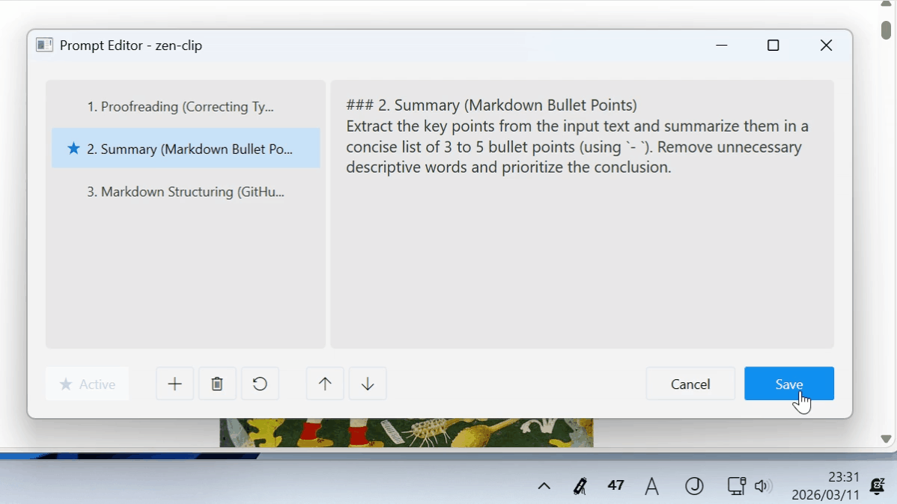
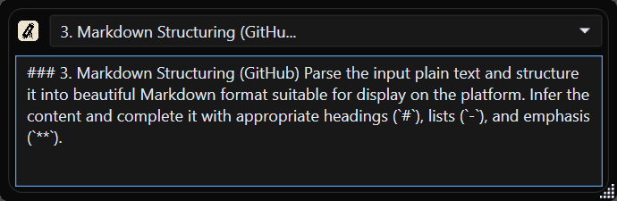
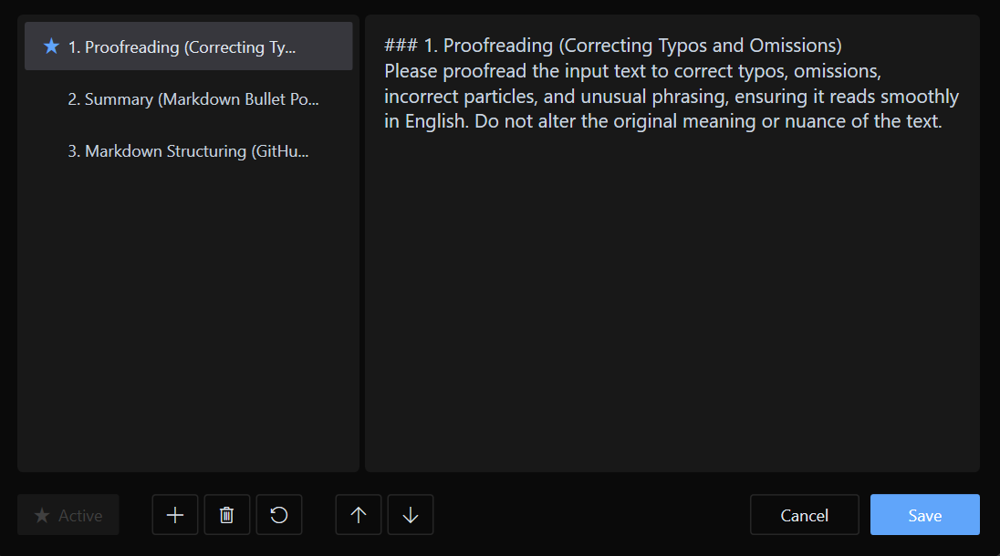
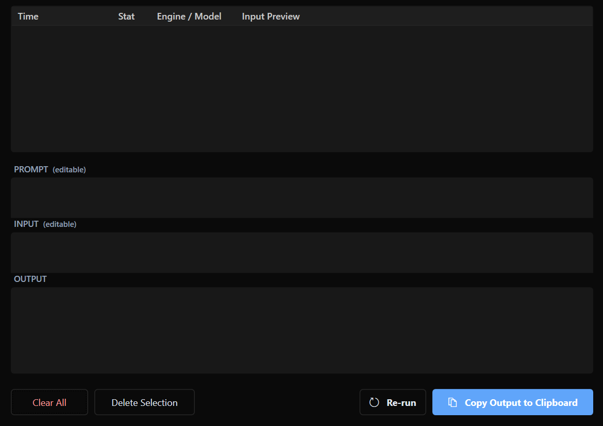
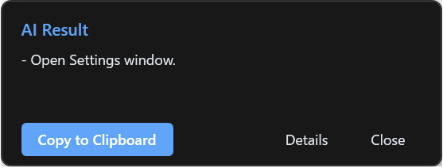

[English](README.md) | [日本語](README.ja.md)

# ZenClip

**ZenClip** is an AI-powered clipboard manager that sits in your Windows system tray.
It integrates with your local **Gemini CLI** or **GitHub Copilot CLI** to instantly process clipboard text with custom prompts, without interrupting your workflow.

**Free-to-use (with limitations)**. You can unlock all features by purchasing a Pro license on Polar.

---

## ⚠️ Prerequisites (Mandatory)

To use this application, you must have at least one (or both) of the following CLI tools installed and executable from your command line:

1. **[Gemini CLI](https://geminicli.com/)**: `gemini` command must be executable.
2. **[GitHub Copilot CLI](https://github.com/features/copilot/cli)**: `copilot` command must be executable.

*Please ensure your CLI tools are fully set up before using ZenClip.*

---

## ✨ Key Features

- **Instant AI Processing**: Simply copy text and press a shortcut key (default: `Ctrl + Shift + C`), and the AI will process it in the background.
- **Prompt Window**: Press `Ctrl + Shift + P` to open a small window where you can select a saved prompt or type text directly, then press `Enter` to start processing. Perfect for when you want to send text that's in your head — before you've even copied anything.
  
- **Multi-Engine Support**: Choose between Gemini CLI and GitHub Copilot CLI as your engine.
- **Unobtrusive Design**: Resides quietly in the system tray. A minimal OSD is displayed during processing, and a notification alerts you when finished.
- **Custom Prompts**: Add and manage your own AI instructions (prompts) tailored to your needs.
  
- **History Management**: Automatically saves AI responses. View, reuse, or batch-delete past results from the history window.
  
- **Multilingual Support**: The UI supports both English and Japanese (switches automatically based on OS settings).

### Keyboard Shortcuts

| Shortcut | Action |
| :--- | :--- |
| `Ctrl + Shift + C` | Process copied clipboard text with AI |
| `Ctrl + Shift + P` | Open the prompt window for direct input |

### Icon States
The system tray icon changes based on the application status:

| State | Icon | Description |
| :--- | :--- | :--- |
| **Idle** |  | Ready to process. |
| **Processing** |  | AI is processing your request. |
| **Error** |  | Processing failed. Check your CLI tool status. |

---

## 💎 Free vs Pro Feature Comparison

ZenClip can be used for free as the "Free Version" even without entering a license key.

| Category | Feature | Free Version | Pro Version (License) |
| :--- | :--- | :--- | :--- |
| **Limits** | Registered Prompts | Max 3 | **Unlimited** |
| **Limits** | History Retention | Max 20 items | **Unlimited** |
| **AI Models** | Model Specification | Fixed to Default | **Individually Selectable** |

### Purchasing a Pro License
To unlock all features, please purchase a license.
**[🛒 Purchase ZenClip Pro License on Polar](https://buy.polar.sh/polar_cl_O7UokiAgrxf6j1fNggb0X2cddHfaWymznBB1C3V8jBT)**

*Note: This project has just launched and is still a work in progress. We would truly appreciate it if you could support its development with a donation-like purchase.*

---

## 🚀 How to Use

### 1. Installation
1. Download the ZIP file from the **[latest release page](https://github.com/saka-guchi/zen-clip/releases/latest)**.
2. Extract it to any folder and run `ZenClip.exe`.

### 2. Processing Clipboard Text
1. **Select and copy** the text you want to process.
2. Press the shortcut **`Ctrl + Shift + C`**. 
  
3. **AI processing starts immediately**, and the results are automatically copied to your clipboard (can be changed in settings). 
  

### 3. Using the Prompt Window
1. Press **`Ctrl + Shift + P`** to open the prompt window.
2. Select a prompt from the list or type directly into the text box.
3. Press **`Enter`** to start processing — results will be delivered to your clipboard.

---

## 📄 License
Copyright © 2026 Zen-Do Development. All rights reserved.
While this software is not closed-source, please follow the license terms for redistribution or modification of the executable.